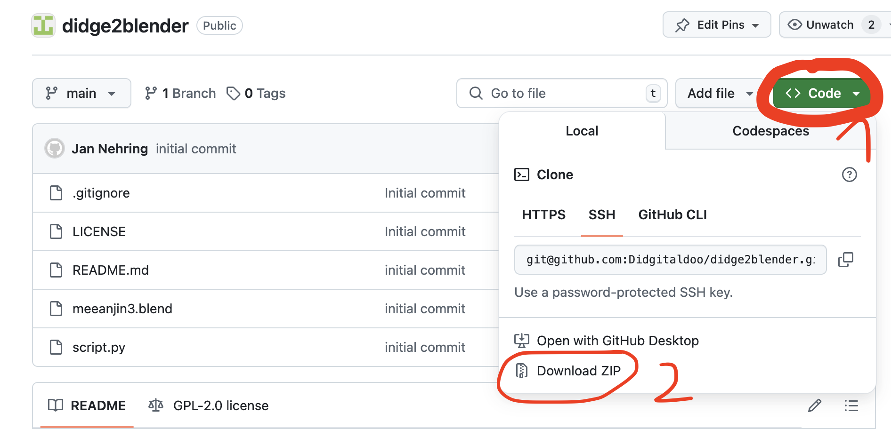
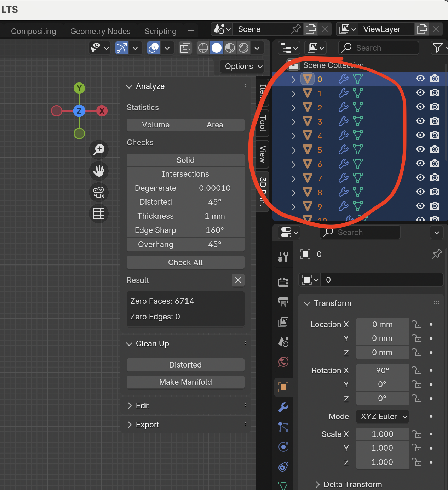
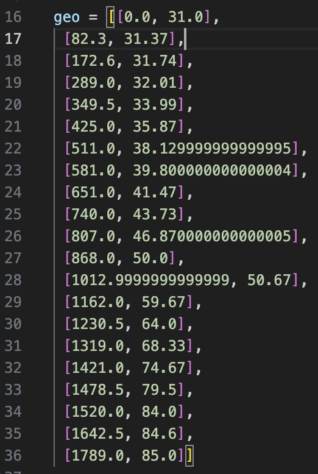
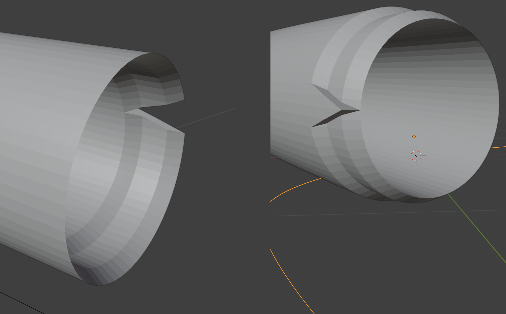

# Didge2Blender

This script helps you create a Blender mesh from your Didgelab didgeridoo shape. Then, you can export the Blender mesh to STL for 3d printing. Find more information about this script on the [Didgitaldoo Website](https://didgitaldoo.github.io/).

## Table of Contents

[Getting started](#getting-started)

* [Download this repository](#download-this-repository)
* [Run the example Blender file](#run-the-example-blender-file)
* [Export to STL](#export-to-stl)

[Using your own Didgelab shape.](#using-your-own-didgelab-shape)

* [Introduction](#introduction)
* [Adding the shape to the script](#adding-the-shape-to-the-script)
* [Create a bended Didgeridoo shape](#create-a-bended-didgeridoo-shape)
* [Divide the didgeridoo into smaller segments](#divide-the-didgeridoo-into-smaller-segments)
* [Other parameters](#other-parameters)

[License](#license)

## Getting started

This part of the guide explains how to create an example STL from a Didgeridoo shape.

### Download this repository



1. On this website, press the "Code" Button and then "Download ZIP" to download this repository. Unpack the ZIP file on your local computer.

### Run the example Blender file

2. Install [Blender](https://www.blender.org/). When writing this guide, I used version 4.2.2. You should try using the latest version.
3. Open file `example.blend` from the ZIP archive that you downloaded earlier. You can see an example Didgeridoo.



4. Delete the example didgeridoo. In the top right corner of the screen, delete all segments of the Didgeridoo by selecting them with the mouse and pressing `x` on the keyboard. Do not delete the object called "Curve".


5. Open the scripting tab (1 in the screenshot). It is located on the very right of the menu bar on top of the screen. You might need to scroll the menu bar to the right if your screen is not wide enough to show the whole menu bar. Then, press the "run" button (2 in the screenshot). This should recreate the Blender mesh that you deleted earlier. If you go back to the layout tab you should see the Blender mesh.

### Export to STL

6. Download and install the [Rheo STL Blender Addon](https://rheologic.net/articles/blender-object-export-separate-stl/). This addon lets you export the segments of the Didgeridoo as separate STL files.
7. Go to File -> Export -> Rheo STL and export the files.

## Using your own Didgelab shape.

This part of the guide explains how to create your own Didgelab shapes and create a Blender mesh from this. 

### Introduction

We assume that you are familiar with the [Didgelab shape format](https://didgitaldoo.github.io/2025/04/19/explain-didgelab-shape-format.html). We will encode the didgeridoo shape in JSON format. Lets assume that we want to create an STL from the [Open Didgeridoo Shape](https://www.windproject.it/open-didgeridoo/). The JSON looks like this:

```
[[0,32], [800,32], [900,38], [970,42], [1050, 40], [1180, 48], [1350, 60], [1390, 68], [1500, 72]]
```

### Adding the shape to the script

The Blender script that you executed earlier executes the script `script.py` which you downloaded when you downloaded the repository earlier. This is written in the programming language Python. Even if you are not familiar with Python, you can modify the script as shown here. 

First, open script with a text editor. Do not use Microsoft Word. Use either the built-in text editor of your operating system, or a programming IDE such as [visual studio code](https://code.visualstudio.com/).



Lines 16-36 of this script define the didgeridoo shape. Remove this part and add your own geometry. In our example it will look like this:

```
geo = [[0,32], [800,32], [900,38], [970,42], [1050, 40], [1180, 48], [1350, 60], [1390, 68], [1500, 72]]
```

Afterwards, there is a line like 

```
split_it = True
```

Change this to 

```
split_it = False
```

Save the file. Then, go back to Blender and execute the script. You should see the Open Didgeridoo as a single mesh.

### Create a bended Didgeridoo shape

Next, we assume that you would like to create a bended Didgeridoo shape, e.g., the bended didgeridoo from the example shape. This tutorial does not cover how to create curve in Blender. We assume that you know this or find it out using the youtube tutorials.

1) Create a durve in Blender. Name the curve "Curve". I use nurbs curves but it works with every type of curve. 
2) Create a Blender shape. If there is a curve called "Curve", the Didgeridoo will follow this curve.
3) Often, the Didgeridoo will be too short or too long for the curve. In this case, scale the curve. To scale the curve, first select it in the Scene Collection (top right corner of the screen). Then, go do edit mode (press tab key to switch from edit to object mode and back). Press "s" to activate scaling. Move the mouse up or down to scale the curve to the right size.

### Divide the didgeridoo into smaller segments

3D printers have small print chambers. Therefore, you need to cut the Didgeridoo into multiple segments to print individually. After printing, you glue the individual parts together. Didge2Blender has a function to split the big mesh into many smaller parts. Also, it will create better joints that are more stable after glueing. The image shows these joints.



The [example script](script.py#L42-L103) shows how to create these joints. First, you have to set this variable `split_it=True`. Then, you can define the joints.

```
{
    "z": 100,
    "type": SPLIT_WIDENING
},
```

This is a joint at length 100mm of the bore. Also, there are two types of joints, SPLIT_NARROWING and SPLIT_WIDENING. You can change it to see which one is which.

### Other parameters

| parameter             | description                                                                                                             |
|-----------------------|-------------------------------------------------------------------------------------------------------------------------|
| joint_length          | how long is each joint (in mm)                                                                                          |
| n_circle_segments     | how many parts does a circle have?                                                                                      |
| z_resolution          | the script will create a ring every z_resolution mm. higher values will create smoother shapes with larger file sizes.  |
| wall_thickness        | how thick is the didgeridoo wall in mm                                                                                  |
| mouthpiece_length     | length of the mouthpiece in mm                                                                                          |
| mouthpiece_widening   | how many mm does the mouth piece open up                                                                                |
| mouthpiece_r          | the size of the rounding at the inner mouth end of the mouthpiece                                                       |
| mouthpiece_resolution | like z_resolution, but for the mouth piece. the mouth piece should be very smooth.                                      |

## License

[Creative Commons Attribution-NonCommercial-ShareAlike 4.0 International](https://creativecommons.org/licenses/by-nc-sa/4.0/deed.en)
